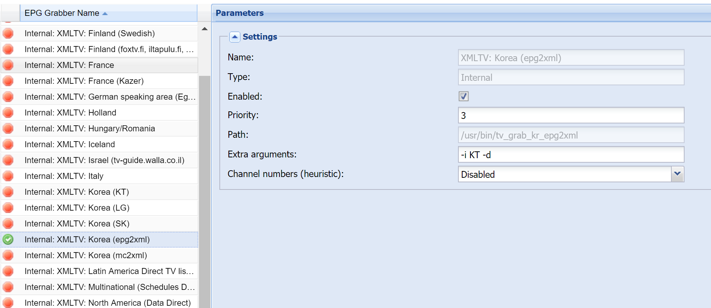
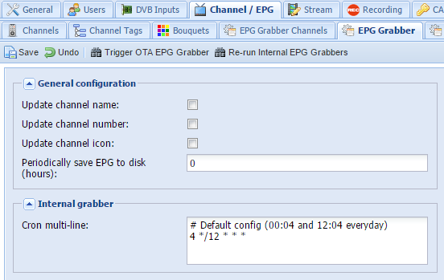
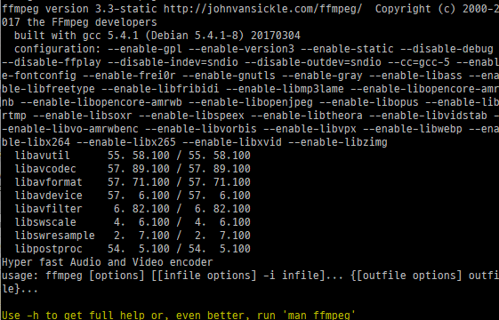
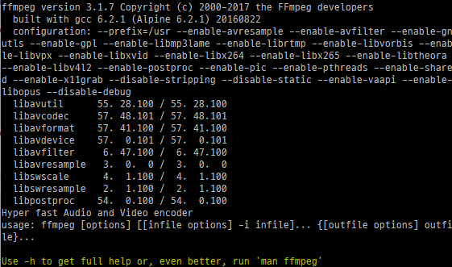

# docker-tvheadend

다음의 특징을 가지는 docker용 tvheadend 이미지

#### linuxserver/tvheadend 기반

다양한 docker용 어플리케이션 이미지를 제작/배포하고 있는 [linuxserver.io](https://linuxserver.io/)의 [소스](https://github.com/linuxserver/docker-tvheadend)를 기반으로 한다. 차이점은 tvheadend 빌드 옵션 중 ```--disable-*_static```을 제거하여 좀 더 나은 transcoding이 가능하게 한다. 또한 본 이미지는 ```x86 64``` 기반이다.

#### 대한민국 IPTV를 위한 EPG grabber 탑재

이 기능은 [epg2xml](https://github.com/wonipapa/epg2xml)과 내장 [tv_grab_file](https://github.com/nurtext/tv_grab_file_synology)을 이용하였다.

## 실행 방법

#### docker 명령어 사용시:

```bash
docker run -d \
    --name=<container name> \
    --network=host \
    -v <path to recordings>:/recordings \
    -v <path to config>:/config \
    -e TZ=<timezone> \
    -e PUID=<UID for user> \
    -e PGID=<GID for user> \
    wiserain/tvheadend:latest
```

#### docker-compose 사용시:

```yml
version: '2'

services:
  <service name>:
    container_name: <container name>
    image: wiserain/tvheadend:latest
    restart: always
    network_mode: "host"
    volumes:
      - <path for config>:/config
      - <path for recordings>:/recordings
    environment:
      - PUID=<UID for user>
      - PGID=<GID for user>
      - TZ=Asia/Seoul
```

#### Synology DSM 사용시:

[별도 문서 참조](docs/how-to-run-on-synology.md)

## 관련 설정들

**이미지 태그 네이밍 규칙**

- **latest**: 최신 이미지 버전. 대부분의 유저에게 권장 됨.
- **ver-build**: [과거 이미지 버전](https://hub.docker.com/r/wiserain/tvheadend/tags/)으로 tvheadend 빌드를 따른다. 예를 들어 ```4.1-2533```.
- **unstable**: 개발 및 테스트 버전
- **stable**: 최신 tvheadend release 버전 [참고](https://doozer.io/tvheadend/tvheadend)

**네트워크 모드**

docker는 멀티캐스트 패킷 라우팅이 안되기 때문에 tvheadend를 이용해 IPTV를 보기 위해서는 무조건 ```hosted network```를 사용해야 한다. 일부 낮은 버전에서는 지원하지 않으니 참고. (예를 들면 Synology DSM 5.2)

**환경변수**

- ```PUID```, ```PGUI```: 컨테이너 내부의 앱이 외부의 볼륨에 접근할 수 있도록 하는 권한에 대한 것이다. [여기](https://github.com/linuxserver/docker-tvheadend#user--group-identifiers)를 참고하여 설정한다. 적절하게 설정하지 않으면, EPG 관련 스크립트가 동작하지 않거나 녹화가 안될 수 있다.
- ```TZ```: 시스템이 사용할 timezone 설정이다. 이게 제대로 안되면 EPG에 시간차가 발생한다. 한국 사용자를 고려하여 기본적으로 ```Asia/Seoul```로 설정되어있다.

## EPG 사용법

컨테이너를 실행 후 ```http://localhost:9981/```를 통해 WEBUI로 접속한 다음, ```Configuration > Channel / EPG > EPG Grabber Modules```로 이동하면 아래 이미지와 같이 3개의 IPTV 서비스를 위한 internal XMLTV grabber가 마련되어 있으니 Enable 시켜서 사용하면 된다.



이미지 태그 기준 4.1-2493 버전부터 아래와 같은 하드코딩이 아니라 ```epg2xml.py```의 옵션을 전달 받아 실행하는 모듈을 추가하였다.
```
python /epg2xml/epg2xml.py -i {KT/LG/SK} -d
```
왼쪽에서 Korea (epg2xml)을 선택하고 오른쪽 옵션 창에서 epg2xml.py 이후의 arguments를 주면 된다. 위 그림 참고.

**처음 EPG 설정 시 유의사항**

Socket으로 직접 밀어 넣는 external grabber와는 달리 내부적으로 cron을 실행한다. 아래 그림과 같이 EPG Grabber 탭에 보면 기본 설정으로 매일 12시 24시 4분에 실행해서 epg를 가져온다. 하지만 버그가 있는지 기본 설정을 무시하고 끊임없이 실행되는 문제가 초반에 있다. 그러므로 설정을 바꿔서 저장해주고 Re-run Internal EPG Grabbers를 눌러서 실행해준다. 어떤 값으로든 변경 후에는 문제없이 정상적으로 동작하는 것을 확인하였다. Cron 설정 방법에 대해서는 [링크](http://docs.tvheadend.org/webui/config_epggrab/#cron-multi-line-config-text-areas)를 참고바람.



## 덧붙이기

#### Static FFMPEG 설치 방법

[tobbenb/tvheadend-unstable](https://github.com/tobbenb/docker-containers/tree/master/tvheadend-unstable)에서 참고한 방법인데 외부의 [static build binary](https://johnvansickle.com/ffmpeg/)를 적용하는 것이다. 아래와 같은 차이가 있다. 오른쪽이 자체 빌드 버전.

 | 
---|---

다음과 같이 환경 변수를 통해 설치할 수 있다. ```FFMPEGBIN_VER=latest``` 바이너리 배포 사이트가 과거 버전을 공개하지 않으므로 ```latest```가 유일한 옵션이다.
