# Synology에서 docker-tvheadend 실행 방법

이 문서는 Synology DSM에서 docker-tvheadend를 실행하는 방법을 설명한다.

### DSM의 GUI를 이용하는 방법

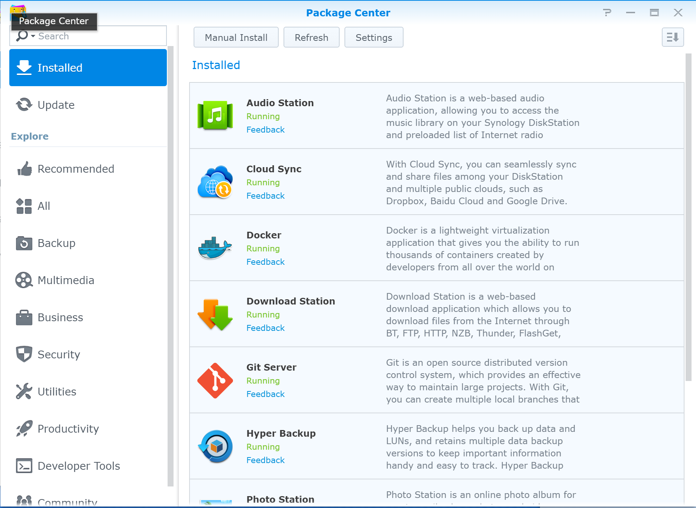

1\. 패키지 센터로 가서 Docker를 설치한다.

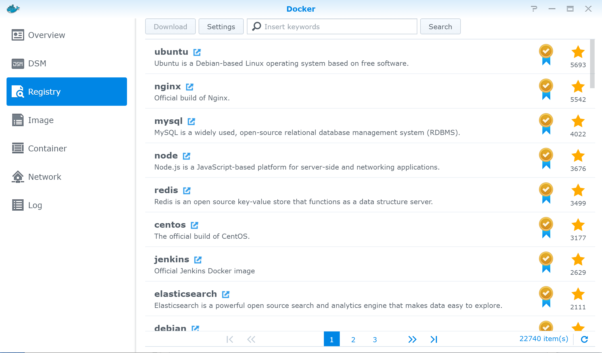

2\. 왼쪽 Registry에서

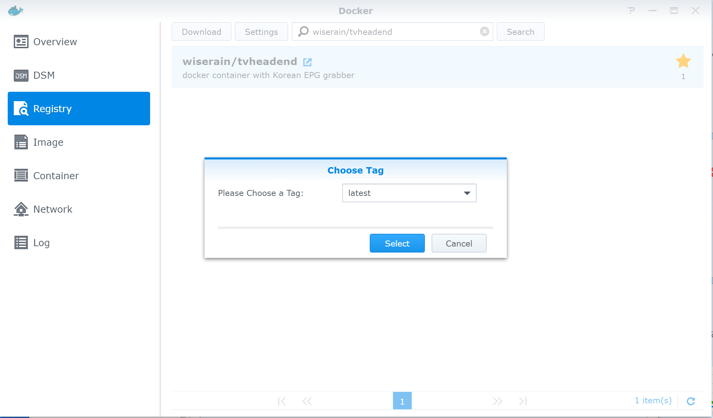

3\. ```wiserain/tvheadend```를 검색하여 다운로드 한다. 드롭 다운 메뉴를 펼쳐 보면 과거 이미지 버전이 있으니 필요할 경우 예전 버전으로 돌아가는 것도 가능하다.

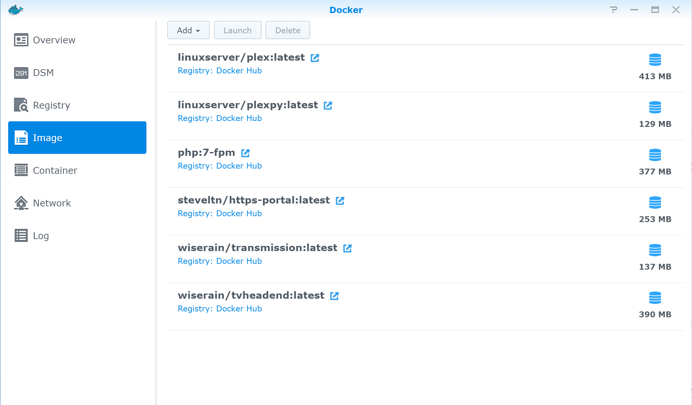

4\. 다운로드가 완료되면 Image 섹션에 나타난다. 이제 이 이미지를 활용해서 tvheadend 앱이 돌아가는 가상의 시스템 공간인 Container를 만든다. 이미지를 선택하고 Launch를 누르면

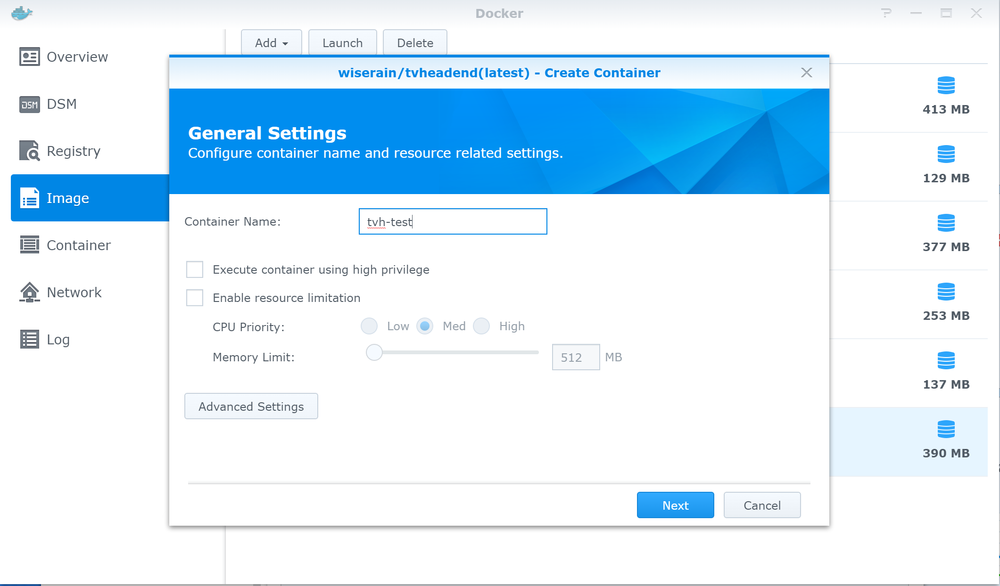

5\. Container의 세부 내용을 설정할 수 있다. 먼저 이름을 적당히 정하고, Advanced Settings를 눌러서 상세 설정을 한다.

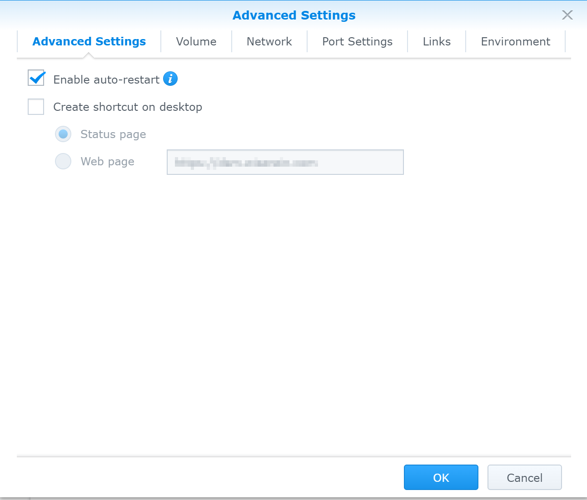

6\. 시놀로지가 껐다 켜져도 자동으로 실행하도록 해야하니 Enable auto-restart에 체크한다.

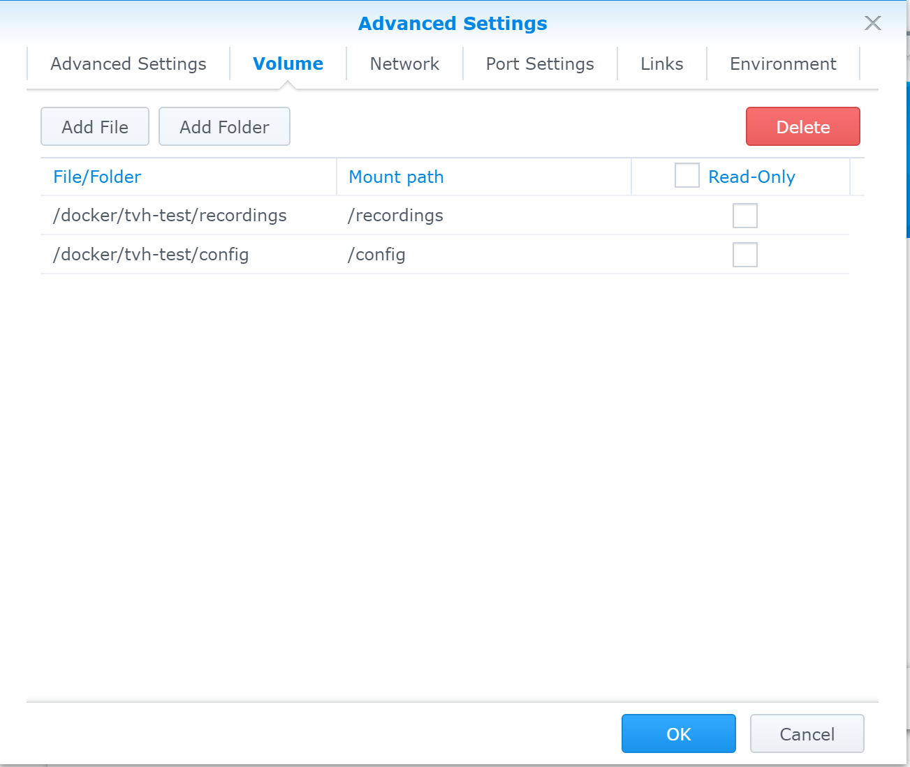

7\. 컨테이너 내부의 공간(Mount path)과 실제 우리가 사용하는 공간을 서로 링크해준다. /config는 tvheadend의 모든 설정이 저장되는 곳이며, /recordings의 경우는 녹화하게 될 경우를 위한 template 폴더이다. 이런 식으로 원하는 경로를 마운트하고 docker container에서 가져다 쓰면 된다.

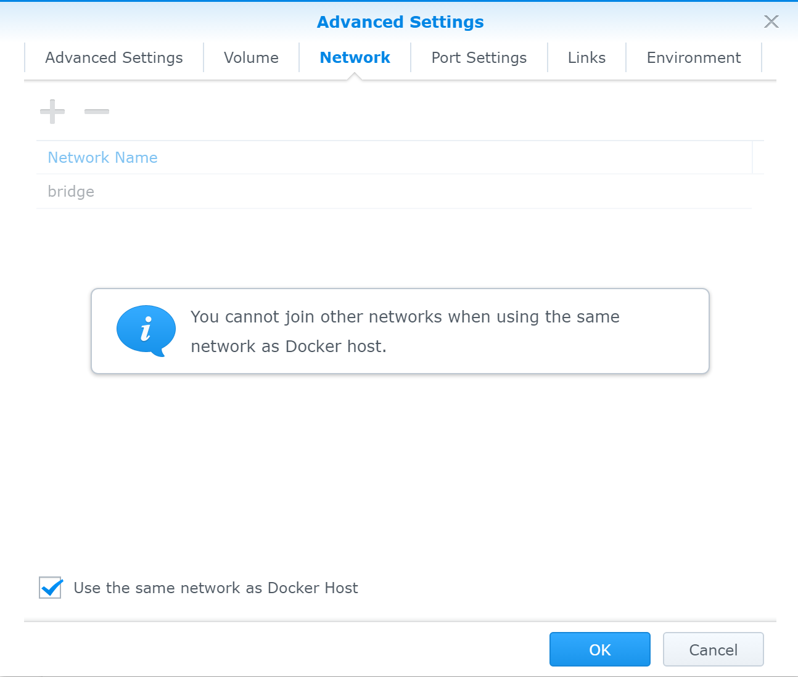

8\. 네트워크는 호스트와 동일 네트워크 사용에 체크. 이전 글에서도 언급했지만, docker는 멀티캐스트 패킷 라우팅이 안되기 때문에 tvheadend는 **무조건 hosted network** 를 사용해야 한다. 일부 낮은 버전에서는 지원하지 않으니 참고. (예를 들면 DSM 5.2)

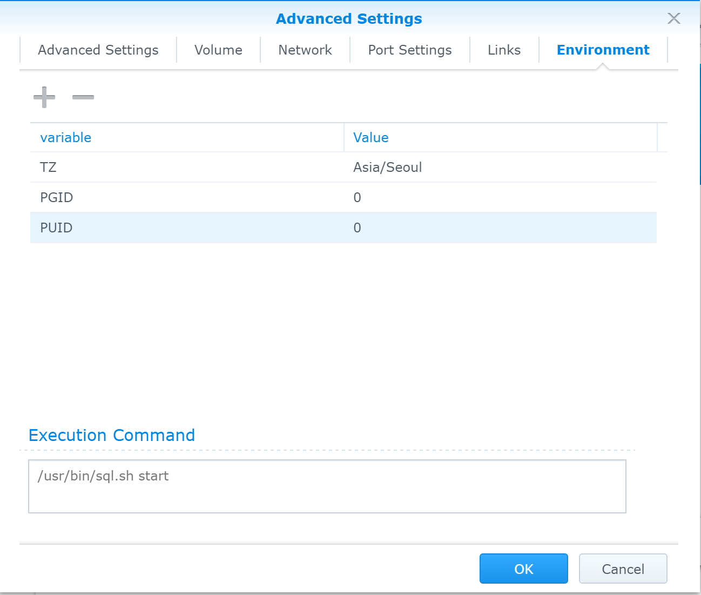

9\. 이제 환경변수를 입력해준다. 이 변수는 그대로 가상 시스템에 전달되어 활용 가능하다. 먼저 ```TZ``` 은 시스템이 사용할 시간대 설정이다. 이게 제대로 안되면 EPG에 시간차가 발생한다. ```PGID``` 와 ```PUID``` 는 컨테이너 내부의 앱이 외부의 볼륨에 접근할 수 있도록 하는 권한에 대한 것이다. [여기](https://hub.docker.com/r/linuxserver/tvheadend/) 의 중간쯤에 잘 설명되어 있는데, 시놀로지에서는 docker가 root 권한으로 동작하므로 아마 0이리라 예상은 되지만, 각자 ssh로 들어가서 확인해보길 바란다.

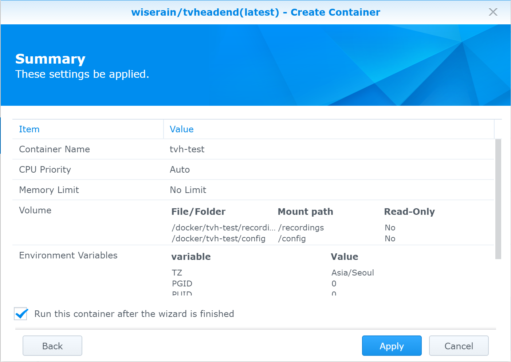

10\. OK를 누르면 설정 내용을 다시 한번 확인하고 create와 동시에 run하도록 체크를 해준다. (원하면 따로 해도 되고)

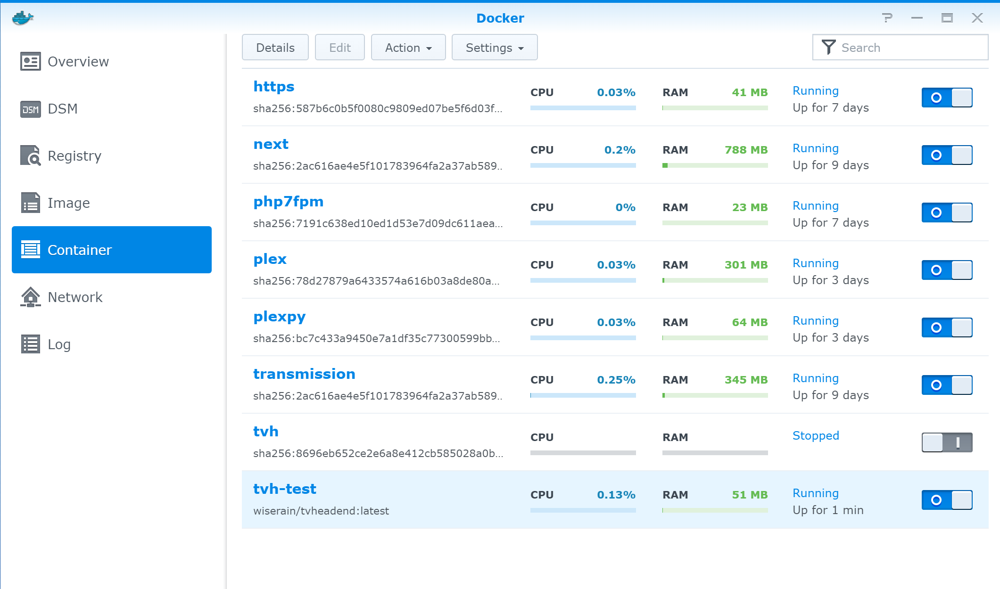

11\. 이제 Container 섹션을 보면 만들어져 실행되고 있는 것을 확인할 수 있다. 여기서 켜고 끄고 지우고 등등 할 수 있다.

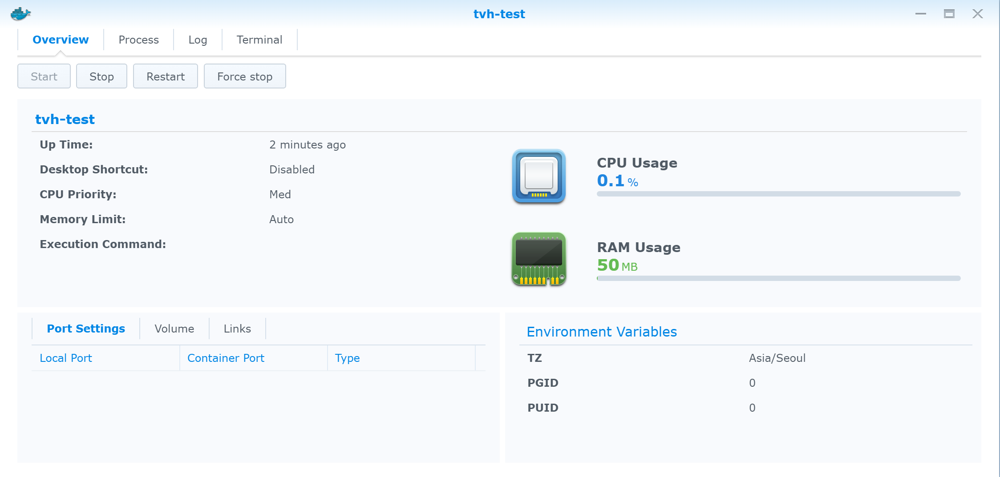

12\. 선택 후 Detail을 누르면 동작하고 있는 정보를 볼 수 있고,

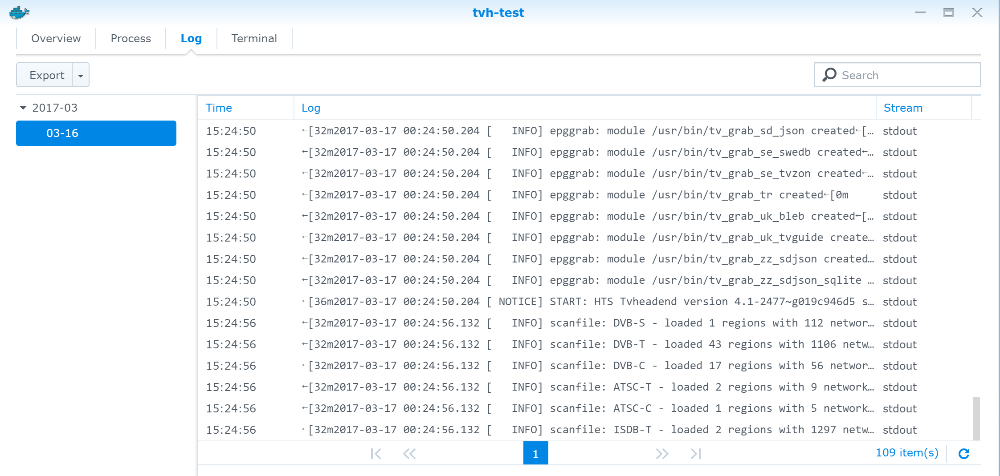

13\. Log 탭에 보면 처음 기동 후의 초기화 작업이 진행 중인 것을 알 수 있다.

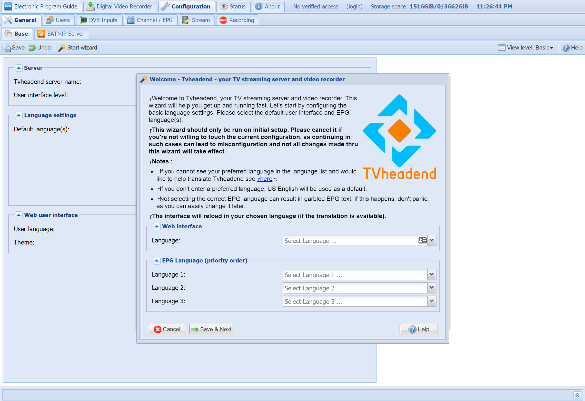

14\. 완료 후 <http://localhost:9981>로 접속하면 tvheadend 초기 설정 메뉴가 보인다.

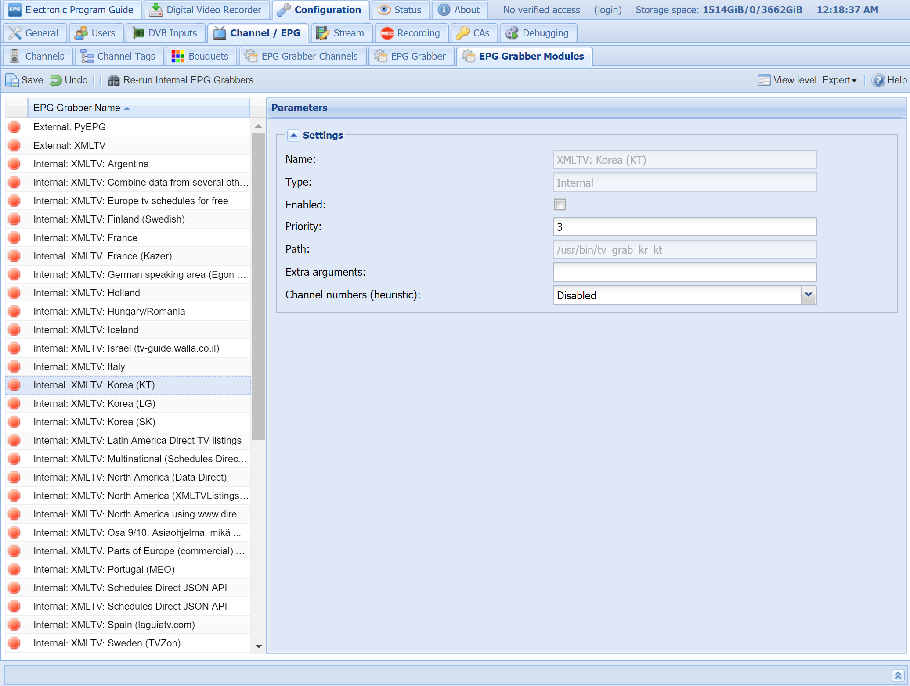

15\. EPG Grabber Modules를 보면 미리 마련해둔 KT LG SK 3사의 Interal XMLTV grabber가 있으니 각자의 iptv 회사에 맞게 켜서 사용하면 된다.

### docker-compose를 이용하는 방법

putty등으로 ssh로 접속하여 docker 경로로 이동한다. (docker는 기본적으로 root 권한이 필요)

```bash
sudo -i
cd /volume1/docker
```

docker-compose.yml 파일을 생성한다.

```bash
vi docker-compose.yml
```

아래 내용을 붙여 넣는다. yml 문법을 따르므로 띄어쓰기 indent를 주의한다.

```yml
version: '2'

services:
  tvh-test:
    container_name: tvh-test
    image: wiserain/tvheadend:latest
    restart: always
    network_mode: "host"
    volumes:
      - /volume1/docker/tvh-test/config:/config
      - /volume1/docker/tvh-test/recordings:/recordings
    environment:
      - PUID=0
      - PGID=0
      - TZ=Asia/Seoul
```
이 내용은 앞에서 DSM GUI로 설정했던 컨테이너의 설정을 그대로 반영한다. 자신의 환경에 맞게 volumes나 container_name 등을 수정하여 사용하도록 한다. 나중에 다른 이미지로부터의 컨테이너가 있으면 services 아래에 추가하면 된다. 저장하고 나와서 아래 명령어를 치면 컨테이너를 생성하고 실행한다.

```
docker-compose up -d <service name e.g. tvh-test>
```

이후 과정은 동일하게 웹 <http://localhost:9981/> 에서 진행한다.
